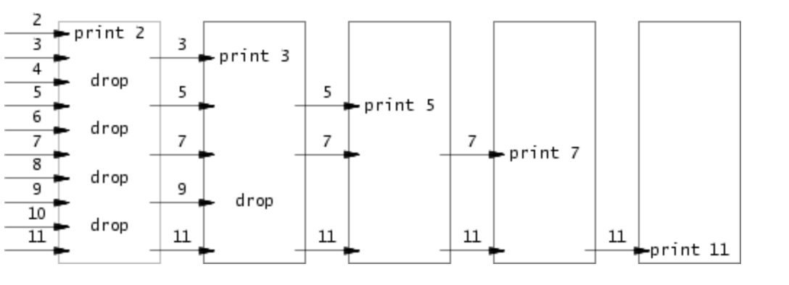

# Lab: Utils

## 1. sleep

让程序休眠指定时间：直接使用系统调用`sleep`

```c
#include "kernel/types.h"
#include "user/user.h"

int
main(int argc, char *argv[])
{
  if (argc < 2){
    fprintf(2, "Usage: sleep seconds...\n");
    exit(1);
  } 

  sleep(atoi(argv[1]));
  exit(0);
}
```

## 2. pingpong

父子进程通过管道进行通信，从`fds[0]`读，向`fds[1]`写入。

```c
#include "kernel/types.h"
#include "user/user.h"

int
main(int argc, char *argv[])
{
  int fds[2];
  if (pipe(fds) < 0) {
      fprintf(2, "pipe creation failed");
      exit(1);
  }

  int pid = fork();
  if (pid == 0){
    // child process
    pid = getpid();
    char c;
    read(fds[0], &c, 1);
    printf("%d: received ping\n", pid);
    write(fds[1], "x", 1);
    close(fds[0]);
    close(fds[1]);
  } else {
    pid = getpid();
    char c;
    write(fds[1], "x", 1);
    read(fds[0], &c, 1);
    printf("%d: received pong\n", pid);
    close(fds[0]);
    close(fds[1]);
  }
  exit(0);
}

```

## 3. primes

利用父子进程之间的`pipeline`筛选素数，每个进程负责筛选一个base。



```c
#include "kernel/types.h"
#include "user/user.h"

void primes(int parent_fd);

int
main(int argc, char *argv[])
{
  int fds[2];
  pipe(fds);
  if (fork() == 0)
  {
    close(fds[1]);
    primes(fds[0]);
  } else {
    close(fds[0]);
    for (int i = 2; i < 36; i++)
    {
      write(fds[1], &i, sizeof(int));
    }
    close(fds[1]);
    int status;
    wait(&status);
  }
  exit(0);
}

void primes(int parent_fd) {
  int base;
  if (read(parent_fd, &base, sizeof(int)) == 0)
  {
    close(parent_fd);
    exit(0);
  }

  int child_fds[2];
  pipe(child_fds);
  if (fork() == 0) {
    close(child_fds[1]);
    primes(child_fds[0]);
  } else {
    close(child_fds[0]);
    printf("prime %d\n", base);
    int key;
    while (read(parent_fd, &key, sizeof(int)) != 0)
    {
        if (key % base != 0) {
            write(child_fds[1], &key, sizeof(int));
        }
    }
    close(parent_fd);
    close(child_fds[1]);
    int status;
    wait(&status);
  }  
}
```

## 4. find

利用文件系统调用查找目录下指定文件名的文件。

```c
#include "kernel/types.h"
#include "user/user.h"
#include "kernel/fs.h"
#include "kernel/stat.h"


char*
fmtname(char *path)
{
  static char buf[DIRSIZ+1];
  char *p;

  // Find first character after last slash.
  for(p=path+strlen(path); p >= path && *p != '/'; p--)
    ;
  p++;

  if(strlen(p) >= DIRSIZ)
    return p;
  memmove(buf, p, strlen(p));
  buf[strlen(p)] = 0;
  return buf;
}


void
find(char *path, char *file_name)
{
  char buf[512], *p;
  int fd;
  struct dirent de;
  struct stat st;

  if((fd = open(path, 0)) < 0){
    fprintf(2, "find: cannot open %s\n", path);
    return;
  }

  if(fstat(fd, &st) < 0){
    fprintf(2, "ls: cannot stat %s\n", path);
    close(fd);
    return;
  }

  switch(st.type){
  case T_FILE:
    char* name = fmtname(path);
    // printf("%s\n", file_name);
    // printf("%s\n", name);
    // printf("%d\n", strlen(name));
    // printf("%d\n", strlen(file_name));
    if (strcmp(name, file_name) == 0)
    {
        printf("%s\n", path);
    }
    break;

  case T_DIR:
    if(strlen(path) + 1 + DIRSIZ + 1 > sizeof buf){
      printf("ls: path too long\n");
      break;
    }
    strcpy(buf, path);
    p = buf+strlen(buf);
    *p++ = '/';
    while(read(fd, &de, sizeof(de)) == sizeof(de)){
      if(de.inum == 0)
        continue;
      if (strcmp(de.name, ".") == 0 || strcmp(de.name, "..") == 0)
      {
        continue;
      }
    //   printf("%s\n", de.name);
    //   printf("%d\n", strlen(de.name));
      memmove(p, de.name, DIRSIZ);
      p[1 + strlen(de.name) + 1] = 0;
      find(buf, file_name);
    }
    break;
  }
  close(fd);
}


int
main(int argc, char *argv[]) {
//   printf("%s\n", argv[1]);
//   printf("%s\n", argv[2]);
  find(argv[1], argv[2]);
  exit(0);  
}
```

## 5. xargs

`xargs`用于将标准输入（通常是从管道传递过来的输出）转换为命令行参数，作为指定命令的输入。

```c
#include "kernel/types.h"
#include "user/user.h"

int
main(int argc, char *argv[])
{
  char buf[20];
  char* args[32];
  args[0] = malloc(strlen(argv[0]) + 1);
  int arg_count;
  for (int i = 1; i < argc; i++) {
    args[i - 1] = malloc(strlen(argv[i]) + 1);
    strcpy(args[i - 1], argv[i]);
  }

  while (1)
  {
    arg_count = argc - 1;
    char input;
    if(read(0, &input, 1) == 0) {
        break;
    }

    int i = 0;
    while (input != '\n')
    {
        if (input == ' ')
        {
            buf[i] = 0;
            args[arg_count] = malloc(strlen(buf) + 1);
            strcpy(args[arg_count], buf);
            arg_count++;
            i = 0;
        } else {
            buf[i] = input;
            i++;
        }
        read(0, &input, 1);
    }
    buf[i] = 0;
    args[arg_count] = malloc(strlen(buf) + 1);
    strcpy(args[arg_count], buf);

    if (fork() == 0)
    {
        // printf("%s\n", args[0]);
        exec(args[0], args);
    } else {
        int status;
        wait(&status);
        // printf("666\n");
        for (int i = argc - 1; i <= arg_count; i++) {
          // printf("args: %s\n", args[i]);
          free(args[i]);
        }
    }
  }
  for (int i = 1; i < argc; i++) {
    free(args[i - 1]);
  }

  exit(0);
}
```

