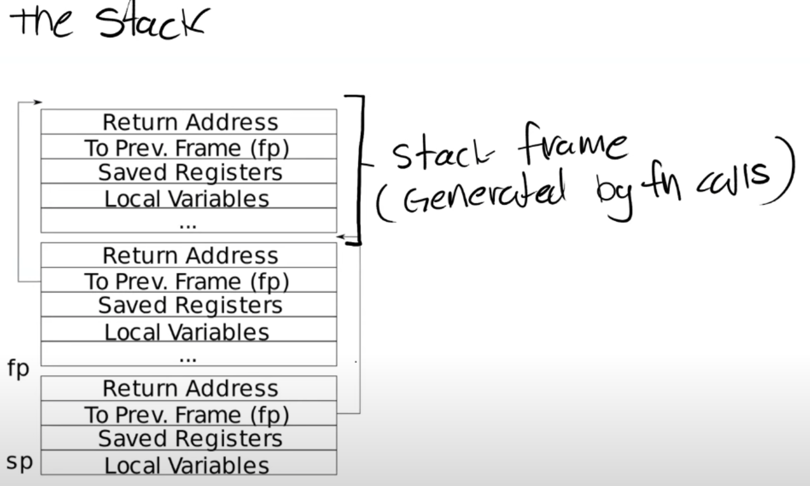

# Lab: traps

## 1. Backtrace

实现一个函数，能够打印出函数调用链。栈上每一个函数对应一个栈帧，每一个栈帧开头保存了调用者的指令地址。



```c
void
backtrace(void) {
  uint64 cur_fp = r_fp();
  uint64* p = (uint64*)(cur_fp);
  uint64 high_addr = PGROUNDUP(cur_fp);

  printf("backtrace:\n");
  while ((uint64)p < high_addr) {
    printf("%p\n", *(p-1));
    cur_fp = *(p-2);
    p = (uint64*)(cur_fp);
  }
}
```

xv6为每一个用户进程只分配一个页作为栈空间，所以可以通过检查fp是否到达页的高地址判断是否到达函数调用链的开头。

# 2. Alarm

添加一个新的系统调用`sigalarm(interval, handler)`，进程每消耗`interval`个时间片，kernel就要为该进程调用一次`handler`函数。

实现`sigalarm`系统调用，记录下传入的`handler`地址。

```c
uint64
sys_sigalarm(void)
{
  int ticks;
  uint64 handler;
  if(argint(0, &ticks) < 0)
    return -1;
  if(argaddr(1, &handler) < 0)
    return -1;

  struct proc* p = myproc();
  p->ticks = ticks;
  p->handler = (void *)handler;
  return 0;
}
```

修改`usertrap.c`中时钟中断的处理函数，时间片加1，如果达到规定的时间片，调用`handler`函数。需要保存用户程序的上下文，并且设置`has_return`字段，防止在`handler`再次触发`handler`导致上下文被覆盖（不可重入）。

```c
if(which_dev == 2) {
  if (p->passed_ticks + 1 >= p->ticks && p->has_return) {
    *p->alarmframe = *p->trapframe;
    p->has_return = 0;
    p->trapframe->epc = (uint64)p->handler;
    p->passed_ticks = 0;
  } else {
    p->passed_ticks += 1;
  }
  yield();
}
```

实现`sig_return`系统调用，恢复用户程序的上下文。

```c
uint64
sys_sigreturn(void)
{
  struct proc* p = myproc();
  *p->trapframe = *p->alarmframe;
  p->has_return = 1;
  return 0;
}
```